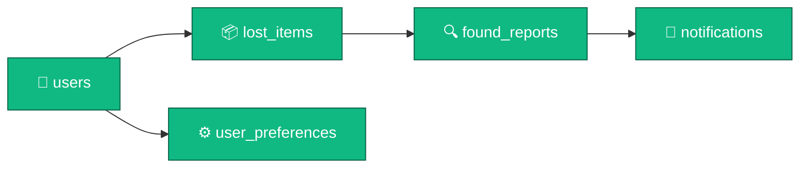

# 🌍 BEACONET-mini

<div align="center">

```ascii
╔══════════════════════════════════════════════════════════════╗
║                                                              ║
║     ██████╗ ███████╗ █████╗  ██████╗ ██████╗ ███╗   ██╗    ║
║     ██╔══██╗██╔════╝██╔══██╗██╔════╝██╔═══██╗████╗  ██║    ║
║     ██████╔╝█████╗  ███████║██║     ██║   ██║██╔██╗ ██║    ║
║     ██╔══██╗██╔══╝  ██╔══██║██║     ██║   ██║██║╚██╗██║    ║
║     ██████╔╝███████╗██║  ██║╚██████╗╚██████╔╝██║ ╚████║    ║
║     ╚═════╝ ╚══════╝╚═╝  ╚═╝ ╚═════╝ ╚═════╝ ╚═╝  ╚═══╝    ║
║                                                              ║
║              🗺️  Lost & Found on the Map  🔍                ║
║                                                              ║
╚══════════════════════════════════════════════════════════════╝
```

**A Laravel-powered interactive mapping platform for reuniting people with their lost belongings**

---


</div>

---

## 🚀 Lightning Fast Setup

<table>
<tr>
<td width="33%">

### 🪟 Windows Batch
```cmd
start.bat
```
*One-click launch*

</td>
<td width="33%">

### ⚡ PowerShell
```powershell
.\start.ps1
```
*Automated setup*

</td>
<td width="33%">

### 🛠️ Manual
```bash
composer install
php artisan key:generate
php artisan migrate --seed
php artisan serve
```
*Full control*

</td>
</tr>
</table>

> 🌐 **Launch URL:** http://127.0.0.1:8000

---

## 🔑 Access Portal

<div align="center">

| Role | Email | Password |
|:----:|:-----:|:--------:|
| 👑 **Admin** | `admin@email.com` | `admin@123123123` |

</div>

---

## ✨ Feature Showcase

<details open>
<summary><b>🗺️ Interactive Map Dashboard</b></summary>

```
┌─────────────────────────────────────────────┐
│  🌍 OpenStreetMap Integration               │
│  📍 Right-click to Drop Location Pin        │
│  🔵 Visual Markers for Lost Items           │
│  🔍 Click Markers for Item Details          │
│  🎯 Real-time GPS Coordinates               │
└─────────────────────────────────────────────┘
```

</details>

<details open>
<summary><b>👤 User Authentication System</b></summary>

- ✅ Instant registration (no email verification)
- 🔐 Secure login with session management
- 🚪 Quick logout functionality
- 🛡️ CSRF protection on all forms

</details>

<details open>
<summary><b>📦 Lost Item Management</b></summary>

```javascript
POST_ITEM {
  ✏️  title: "Your Item Name"
  📝  description: "Detailed description"
  📸  image: "Optional photo upload"
  📍  coordinates: "Auto-captured from map"
  🏷️  status: ["lost", "found", "resolved"]
}
```

</details>

<details open>
<summary><b>🔔 Smart Notification System</b></summary>

| Event | Notification |
|-------|-------------|
| 🎉 Item Found | Instant alert with photo & message |
| 📬 New Report | Details from finder |
| ✅ Status Update | Track your item's journey |
| 🗑️ Manageable | Mark as read or delete |

</details>

<details open>
<summary><b>⚙️ User Settings & Preferences</b></summary>

- 🌓 **Theme Toggle:** Dark/Light mode
- ✏️ **Username Update:** Change display name
- 🔒 **Password Change:** Enhanced security
- 🔔 **Notification Control:** Enable/disable alerts

</details>

<details open>
<summary><b>👨‍💼 Admin Control Center</b></summary>

**Dashboard Stats:**
```
┌─────────────┬─────────────┬─────────────┐
│ 👥 Users    │ 📦 Items    │ 📊 Reports  │
├─────────────┼─────────────┼─────────────┤
│ Total Count │ Lost Items  │ Found Total │
└─────────────┴─────────────┴─────────────┘
```

**Management Tools:**
- 🗑️ Delete users
- 📦 Manage lost items
- 📋 Review found reports
- 🔍 Monitor activity

</details>

---

## 📂 Project Architecture

```
BEACONET-mini/
│
├── 🎮 app/
│   ├── Http/Controllers/      → Business logic layer
│   ├── Models/                → Database entities
│   └── Middleware/            → Admin authorization
│
├── 🗄️ database/
│   ├── database.sqlite        → SQLite database file
│   ├── migrations/            → Schema definitions
│   └── seeders/               → Initial data
│
├── 🎨 resources/views/
│   ├── auth/                  → Login & Register pages
│   ├── dashboard/             → Main application UI
│   ├── admin/                 → Admin interface
│   ├── settings/              → User preferences
│   └── notifications/         → Notification center
│
├── 🛣️ routes/web.php          → URL routing configuration
│
└── 🚀 start.bat / start.ps1    → Quick launch scripts
```

---

## 💾 Database Schema

<div align="center">



</div>

### 📊 Table Structures

<table>
<tr>
<td>

**users**
- 🆔 id
- 👤 name
- 📧 email
- 🔒 password
- 🎭 role

</td>
<td>

**lost_items**
- 🆔 id
- 👤 user_id
- 📝 title
- 📄 description
- 🖼️ image_path

</td>
<td>

**found_reports**
- 🆔 id
- 📦 lost_item_id
- 👤 reporter_id
- 💬 message
- 📸 image_path

</td>
</tr>
</table>

---

## 🛠️ Technology Stack

<div align="center">

| Layer | Technology | Purpose |
|:-----:|:----------:|:-------:|
| ⚙️ **Backend** | Laravel 12 | Application framework |
| 🗄️ **Database** | SQLite | Data persistence |
| 🎨 **Frontend** | HTML5/CSS3/JS | User interface |
| 🗺️ **Mapping** | Leaflet.js | Interactive maps |
| 🔐 **Auth** | Laravel Auth | User management |
| 📁 **Storage** | Local Storage | File uploads |

</div>

---

## 🔄 User Workflows

### 📍 Posting a Lost Item

```
1️⃣ Navigate to Dashboard
2️⃣ Fill in item details
3️⃣ Right-click map to set location ← IMPORTANT!
4️⃣ Upload optional image
5️⃣ Click "Post Item"
6️⃣ Item appears as marker for all users
```

### 🔍 Reporting a Found Item

```
1️⃣ Click any marker on the map
2️⃣ View item details in modal
3️⃣ Click "Found this item?"
4️⃣ Describe where you found it
5️⃣ Upload photo evidence
6️⃣ Submit report
7️⃣ Owner receives notification
```

### 🎯 Managing Your Items

```
✓ View all your posted items in sidebar
✓ Delete items you've posted
✓ Check received found reports
✓ Accept or reject reports
```

---

## 🌐 API Routes

<details>
<summary><b>Public Routes</b></summary>

- `GET /` - Home page
- `GET /login` - Login form
- `GET /register` - Registration form

</details>

<details>
<summary><b>Authenticated Routes</b></summary>

- `GET /dashboard` - Main map interface
- `GET /notifications` - Notification center
- `GET /settings` - User preferences
- `POST /lost-items` - Create lost item
- `POST /found-reports` - Submit found report

</details>

<details>
<summary><b>Admin Routes</b></summary>

- `GET /admin` - Admin dashboard
- `GET /admin/users` - User management
- `GET /admin/lost-items` - Item management
- `GET /admin/found-reports` - Report management

</details>

---

## 🚀 Deployment Guide

### First Time Installation

```bash
# Navigate to project directory
cd c:\Users\melch\tong_padua_tacus\BEACONET-mini

# Install dependencies
composer install

# Generate application key
php artisan key:generate

# Run migrations and seed database
php artisan migrate --force
php artisan db:seed

# Create storage symlink
php artisan storage:link

# Start development server
php artisan serve
```

### Subsequent Launches

```bash
php artisan serve
```

> 🌐 Visit **http://127.0.0.1:8000** in your browser

---

## 🧪 Testing Guide

<table>
<tr>
<td width="50%">

### 👤 Create Test Account
1. Click "Register"
2. Enter name, email, password
3. Submit (no verification)
4. Auto-login ✅

</td>
<td width="50%">

### 📦 Post Test Item
1. Fill item form
2. **Right-click map** for location
3. Add title + image
4. Submit ✅

</td>
</tr>
<tr>
<td width="50%">

### 🔍 Find Test Item
1. Click any map marker
2. Click "Found this item?"
3. Add message + photo
4. Submit ✅

</td>
<td width="50%">

### 👨‍💼 Test Admin Access
1. Logout current user
2. Login as admin
3. Click "Admin Panel"
4. Explore dashboard ✅

</td>
</tr>
</table>

---

## 🆘 Troubleshooting

<details>
<summary><b>❌ Composer Installation Failed</b></summary>

```bash
composer install --prefer-source --no-interaction
```

</details>

<details>
<summary><b>❌ Database Issues</b></summary>

```bash
php artisan migrate:refresh --seed
```

</details>

<details>
<summary><b>❌ Missing Storage Link</b></summary>

```bash
php artisan storage:link
```

</details>

<details>
<summary><b>❌ Port 8000 Already in Use</b></summary>

```bash
php artisan serve --port=8001
```

</details>

---

## 🔒 Security Features

<div align="center">

```
┌──────────────────────────────────────────────┐
│                                              │
│  ✅ CSRF Protection on All Forms            │
│  ✅ Password Hashing (bcrypt)               │
│  ✅ User Authorization Checks               │
│  ✅ Admin-Only Middleware                   │
│  ✅ SQL Injection Protection (ORM)          │
│  ✅ Secure Session Management               │
│                                              │
└──────────────────────────────────────────────┘
```

</div>

---

## 📝 Key Notes

> 💡 **Database:** SQLite included at `database/database.sqlite`  
> 💡 **Images:** Stored in `storage/app/public/`  
> 💡 **Maps:** Free OpenStreetMap tiles  
> 💡 **Admin:** Created automatically on seed  
> 💡 **Privacy:** All data stored locally

---

## 📚 Resources

<div align="center">

[](https://laravel.com/docs)
[](https://leafletjs.com/)

</div>

---

## 📊 Project Status

<div align="center">

| Metric | Status |
|--------|--------|
| 📦 **Version** | 1.0.0 |
| 📅 **Created** | January 2026 |
| 🛠️ **Framework** | Laravel 12 |
| 🗄️ **Database** | SQLite |
| ✅ **Status** | Production Ready |
| 📜 **License** | MIT |

</div>

---

<div align="center">

### 🌟 Built with Laravel • Powered by Community • Mapping Lost to Found 🌟

```
╔═══════════════════════════════════════════════════════════╗
║  Made with ❤️ for reconnecting people with their items   ║
╚═══════════════════════════════════════════════════════════╝
```

**Happy Mapping! 🗺️✨**

</div>
